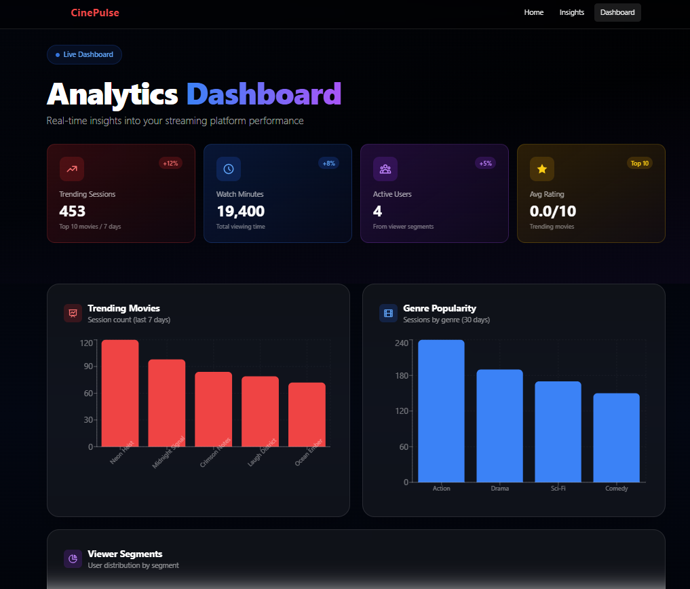
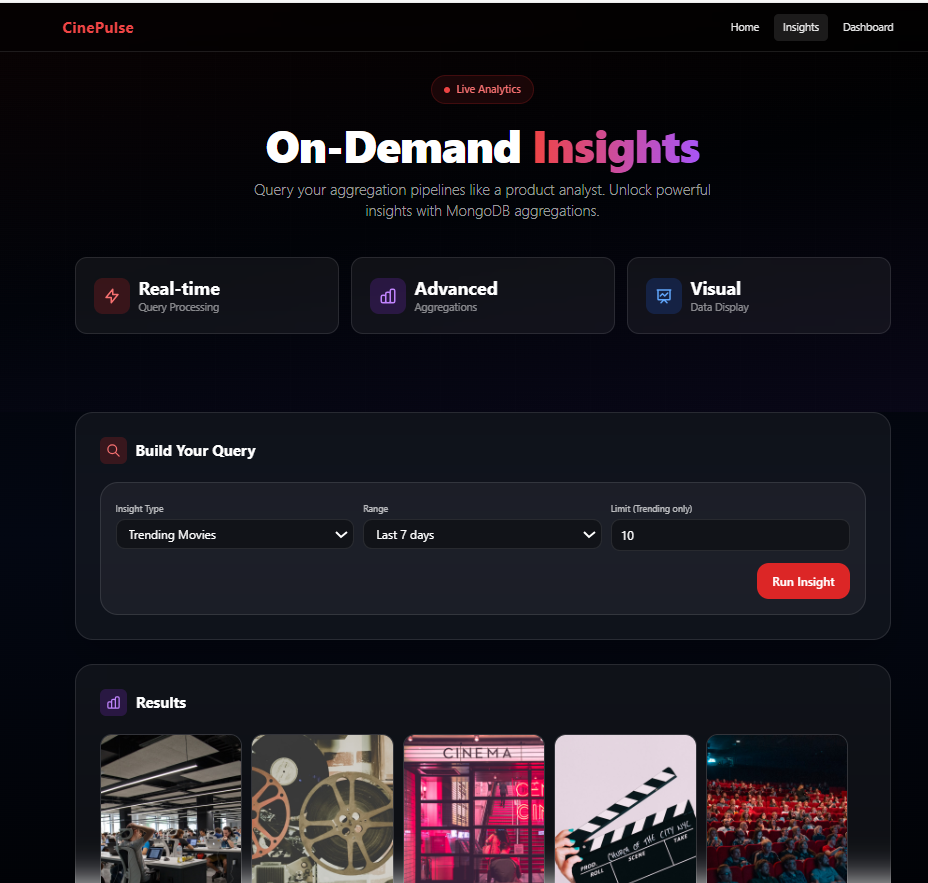
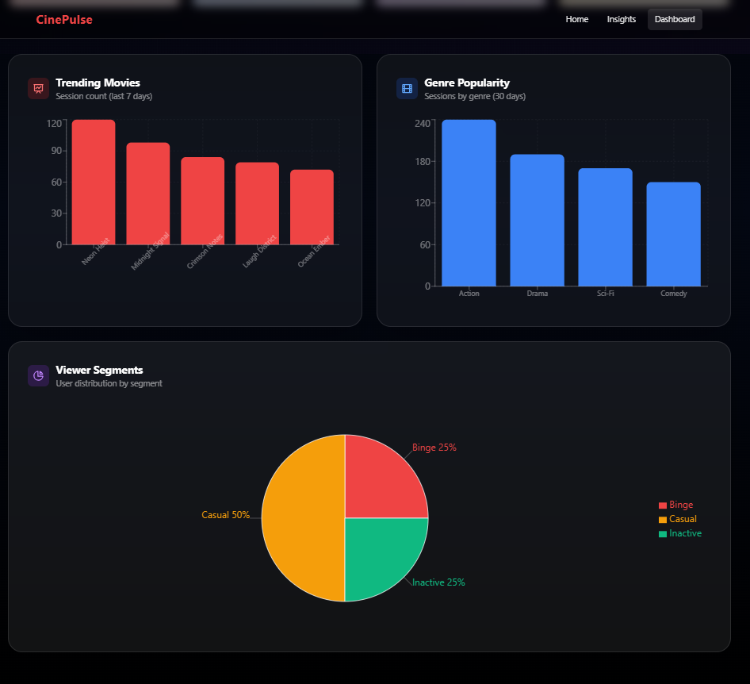

# CinePulse - Movie Analytics Dashboard

> A modern streaming analytics platform powered by MongoDB aggregations and React

[](https://www.mongodb.com/)
[](https://nodejs.org/)
[](https://reactjs.org/)
[](LICENSE)

## What is this?

CinePulse is a **movie analytics dashboard** that demonstrates how to build a Netflix-style streaming platform with real-time analytics. The project focuses on using **MongoDB Aggregation Pipelines** to transform viewing session data into meaningful business insights.

This is a learning project that shows how streaming platforms analyze user behavior, track trending content, and segment viewers—all using MongoDB's powerful aggregation framework.

## What You'll See

The application transforms viewing session data like:
```json
{
  "userId": "U123",
  "movieId": "M456",
  "movieTitle": "Inception",
  "genres": ["Sci-Fi", "Thriller"],
  "watchMinutes": 45,
  "rating": 4.5,
  "segment": "Premium",
  "timestamp": "2024-01-15T20:30:00Z"
}
```

Into analytics like:
- Real-time KPIs (total sessions, watch minutes, active users, average ratings)
- Trending movies in the last 7 days
- Genre popularity over 30 days
- Viewer segmentation (Premium, Standard, Free users)
- Custom on-demand insights with query builder

**All calculations happen inside MongoDB** using aggregation pipelines—optimized for large-scale data processing.

## Why This Matters

Streaming platforms like Netflix, Disney+, and HBO Max rely heavily on analytics to:
- Understand what content is trending
- Identify viewer preferences and segments
- Make data-driven decisions about content acquisition
- Optimize user experience and recommendations

This project demonstrates the **backend analytics logic** that powers these insights, along with a **production-quality frontend** to visualize the data.

## Tech Stack

**Frontend:**
- React - UI framework
- Tailwind CSS - Styling and design system
- Recharts - Data visualization library
- React Router - Client-side routing

**Backend:**
- Node.js + Express - REST API server
- MongoDB - Database with aggregation pipelines
- Mongoose - MongoDB object modeling

**Design:**
- Glassmorphism UI with frosted glass effects
- Dark theme with gradient overlays
- Responsive, mobile-first design
- Netflix-inspired cinematography

## Data Model

The project uses a minimal, intentional schema optimized for analytics:

### Movies Collection
```javascript
{
  _id: ObjectId,
  title: "Inception",
  genres: ["Sci-Fi", "Thriller"],
  releaseYear: 2010,
  durationMins: 148,
  createdAt: Date
}
```

### Watch Sessions Collection
```javascript
{
  _id: ObjectId,
  userId: "U123",
  movieId: "M456",
  watchedAt: Date,
  minutesWatched: 45,
  device: "mobile" | "web" | "tv"
}
```

### Users Collection
```javascript
{
  _id: ObjectId,
  name: "John Doe",
  segment: "Premium" | "Standard" | "Free",
  joinedAt: Date
}
```

**Why This Schema?**

The schema is designed specifically for aggregation workloads:
- Embedded genres array allows efficient `$unwind` operations
- Direct `movieId` and `userId` references enable fast joins with `$lookup`
- `watchedAt` timestamp enables time-based filtering
- Minimal fields reduce document size and improve query performance

## Indexing Strategy

**Performance-focused indexes** for aggregation optimization:

```javascript
// watch_sessions collection
db.watch_sessions.createIndex({ watchedAt: 1 })
db.watch_sessions.createIndex({ movieId: 1, watchedAt: 1 })
db.watch_sessions.createIndex({ userId: 1, watchedAt: 1 })

// movies collection
db.movies.createIndex({ genres: 1 })
```

**Why These Indexes?**
- `watchedAt`: Supports time-range filtering in trending analysis
- `movieId + watchedAt`: Optimizes movie-specific queries over time
- `userId + watchedAt`: Enables efficient user segmentation
- `genres`: Speeds up genre-based aggregations

These indexes are chosen specifically to optimize the most common aggregation pipelines in the application.

## Quick Start

**Prerequisites:**
- Node.js 16+ and npm
- MongoDB 5.0+ (running locally or cloud)

**1. Clone the repository**
```bash
git clone https://github.com/yourusername/cinepulse.git
cd cinepulse
```

**2. Install backend dependencies**
```bash
cd backend
npm install
```

**3. Set up environment variables**

Create a `.env` file in the `backend` directory:
```env
MONGODB_URI=mongodb://localhost:27017/cinepulse
PORT=5000
NODE_ENV=development
```

**4. Seed the database** (optional but recommended)
```bash
npm run seed
```
This creates sample viewing sessions, movies, and user data.

**5. Start the backend server**
```bash
npm run dev
```
Backend runs at `http://localhost:5000`

**6. Start the frontend** (in a new terminal, from project root)
```bash
cd frontend
npm install
npm start
```
Frontend runs at `http://localhost:3000`

**7. Open your browser**

Navigate to `http://localhost:3000` to see the dashboard!

## Screenshots

### Homepage - Netflix-Style Hero Section


*Dynamic hero section with cinematic backgrounds and trending movies*

### Analytics Dashboard


*Real-time KPIs and interactive charts showing trending content and genre popularity*

### Insights Query Builder


*Custom query builder for ad-hoc analysis with MongoDB aggregation pipelines*

### Advanced Analytics


*Deep dive into viewer behavior and content performance*

## How Aggregation Works (Examples)

### Example 1: Top Trending Movies (Last 7 Days)

**Goal:** Find the 10 most-watched movies in the past week

**Aggregation Pipeline:**
```javascript
[
  // Step 1: Filter sessions from last 7 days
  { 
    $match: { 
      timestamp: { $gte: new Date(Date.now() - 7*24*60*60*1000) } 
    } 
  },
  
  // Step 2: Group by movie and count sessions
  { 
    $group: { 
      _id: "$movieId", 
      title: { $first: "$movieTitle" },
      sessions: { $sum: 1 },
      totalMinutes: { $sum: "$watchMinutes" }
    } 
  },
  
  // Step 3: Sort by session count
  { $sort: { sessions: -1 } },
  
  // Step 4: Get top 10
  { $limit: 10 }
]
```

**Result:**
```json
[
  { "_id": "M456", "title": "Inception", "sessions": 1250, "totalMinutes": 93750 },
  { "_id": "M789", "title": "The Matrix", "sessions": 980, "totalMinutes": 88200 },
  ...
]
```

### Example 2: Genre Popularity (Last 30 Days)

**Goal:** See which genres are most popular

**Aggregation Pipeline:**
```javascript
[
  // Step 1: Filter last 30 days
  { 
    $match: { 
      timestamp: { $gte: new Date(Date.now() - 30*24*60*60*1000) } 
    } 
  },
  
  // Step 2: Unwind genres array (one doc per genre)
  { $unwind: "$genres" },
  
  // Step 3: Group by genre and count
  { 
    $group: { 
      _id: "$genres", 
      count: { $sum: 1 },
      watchMinutes: { $sum: "$watchMinutes" }
    } 
  },
  
  // Step 4: Sort by popularity
  { $sort: { count: -1 } }
]
```

**Result:**
```json
[
  { "_id": "Action", "count": 4500, "watchMinutes": 337500 },
  { "_id": "Drama", "count": 3200, "watchMinutes": 288000 },
  { "_id": "Sci-Fi", "count": 2100, "watchMinutes": 189000 }
]
```

### Example 3: Viewer Segmentation

**Goal:** Understand distribution of user segments

**Aggregation Pipeline:**
```javascript
[
  // Group by segment
  { 
    $group: { 
      _id: "$segment", 
      users: { $addToSet: "$userId" }
    } 
  },
  
  // Count unique users per segment
  {
    $project: {
      segment: "$_id",
      userCount: { $size: "$users" }
    }
  },
  
  // Sort by user count
  { $sort: { userCount: -1 } }
]
```

**Result:**
```json
[
  { "segment": "Premium", "userCount": 5600 },
  { "segment": "Standard", "userCount": 8200 },
  { "segment": "Free", "userCount": 12400 }
]
```

## Key Aggregation Concepts Used

| Concept | What It Does | Used For |
|---------|-------------|----------|
| `$match` | Filter documents | Date ranges, specific criteria |
| `$group` | Group and aggregate | Counting sessions, summing watch time |
| `$unwind` | Flatten arrays | Breaking down genre arrays |
| `$sort` | Sort results | Ordering by popularity, date |
| `$limit` | Limit results | Getting top N items |
| `$project` | Shape output | Formatting response data |
| `$addToSet` | Collect unique values | Counting unique users |
| `$size` | Array length | Counting array elements |
| `$first` | Get first value | Retrieving movie titles |

## Features Breakdown

### Dynamic Homepage
- Netflix-style hero section with featured movies
- Interactive movie cards with hover effects
- Cinematic background images with gradient overlays
- Real-time content recommendations

### Analytics Dashboard
- **KPI Cards:** Real-time metrics (sessions, watch minutes, active users, ratings)
- **Trending Chart:** Bar chart showing top 10 trending movies (7-day range)
- **Genre Breakdown:** Pie chart of genre distribution (30-day range)
- **Viewer Segments:** Visual distribution of user types
- Loading states and error handling

### On-Demand Insights
- Custom query builder for MongoDB aggregations
- Filter by date ranges, genres, and metrics
- Real-time query execution
- Visual rendering with charts and tables

### Design Highlights
- Glassmorphism UI with modern frosted glass effects
- Multi-layer gradients for cinematic depth
- Responsive design (mobile-first approach)
- Dark theme optimized for readability
- Smooth animations and micro-interactions

## Core Analytics Insights

The backend exposes **on-demand analytics APIs** built entirely using MongoDB Aggregation Pipelines. Each insight demonstrates a different analytical use case:

### 1. Trending Movies

Identifies most-watched content in recent periods.

**Time Ranges:**
- Last 7 days (short-term trends)
- Last 30 days (monthly trends)

**Metrics:**
- Number of watch sessions
- Total watch minutes
- Unique viewers

**Use Case:** "What content should we feature on the homepage?"

### 2. Genre Popularity

Analyzes which genres are performing best.

**Aggregation:**
- Groups sessions by genre (using `$unwind` for array handling)
- Counts sessions per genre
- Calculates total watch time per genre

**Use Case:** "Which genres should we acquire more content for?"

### 3. Viewer Segmentation

Categorizes users based on viewing behavior.

**Segments:**
- **Binge Users:** ≥10 sessions in last 7 days
- **Casual Users:** 1-9 sessions in last 7 days
- **Inactive Users:** No activity in last 30 days

**Use Case:** "How do we target different user groups with personalized content?"

### 4. Drop-off Analysis

Tracks viewing completion patterns.

**Completion Buckets:**
- **Completed:** ≥90% of movie watched
- **Partial:** 30-90% of movie watched
- **Abandoned:** <30% of movie watched

**Calculation:**
```javascript
completionPercent = (minutesWatched / movieDuration) * 100
```

**Use Case:** "Which content is engaging vs. which content makes users drop off?"

### 5. Dynamic Insights API

Single endpoint that executes different pipelines based on request type.

**Request Structure:**
```json
{
  "type": "trending" | "genre_popularity" | "viewer_segments" | "dropoff",
  "range": "7d" | "30d",
  "limit": 10
}
```

**Architecture:**
```
Request → Route → Controller → Pipeline Builder → MongoDB → Results
```

Each insight type maps to a dedicated aggregation pipeline, not conditional logic scattered across the codebase.

## API Endpoints

The backend exposes a **dynamic insights endpoint** that handles different analytics requests:

### Main Insights Endpoint

```bash
POST /api/insights
Content-Type: application/json
```

### Example Requests

**1. Trending Movies (Last 7 Days)**
```json
{
  "type": "trending",
  "range": "7d",
  "limit": 10
}
```

**Response:**
```json
{
  "insight": "trending",
  "range": "7d",
  "data": [
    {
      "movieId": "M456",
      "title": "Inception",
      "sessions": 1250,
      "totalMinutes": 93750,
      "uniqueViewers": 890
    }
  ]
}
```

---

**2. Genre Popularity (Last 30 Days)**
```json
{
  "type": "genre_popularity",
  "range": "30d"
}
```

**Response:**
```json
{
  "insight": "genre_popularity",
  "range": "30d",
  "data": [
    {
      "genre": "Action",
      "sessions": 4500,
      "watchMinutes": 337500
    }
  ]
}
```

---

**3. Viewer Segmentation**
```json
{
  "type": "viewer_segments"
}
```

**Response:**
```json
{
  "insight": "viewer_segments",
  "data": [
    {
      "segment": "Binge Users",
      "count": 2340,
      "percentage": 18.5
    },
    {
      "segment": "Casual Users",
      "count": 8200,
      "percentage": 64.8
    },
    {
      "segment": "Inactive Users",
      "count": 2110,
      "percentage": 16.7
    }
  ]
}
```

---

**4. Drop-off Analysis (Last 7 Days)**
```json
{
  "type": "dropoff",
  "range": "7d"
}
```

**Response:**
```json
{
  "insight": "dropoff",
  "range": "7d",
  "data": [
    {
      "bucket": "Completed",
      "sessions": 5600,
      "percentage": 62.3
    },
    {
      "bucket": "Partial",
      "sessions": 2400,
      "percentage": 26.7
    },
    {
      "bucket": "Abandoned",
      "sessions": 990,
      "percentage": 11.0
    }
  ]
}
```

### Architecture Flow

```
Frontend Request
      ↓
POST /api/insights
      ↓
Route Handler
      ↓
Controller (validates request)
      ↓
Pipeline Builder (buildPipeline(type))
      ↓
MongoDB Aggregation Execution
      ↓
Format Results
      ↓
JSON Response to Frontend
```

Each insight type maps to a dedicated aggregation pipeline function, ensuring clean separation of concerns and maintainable code.

## What I Learned

Through this project, I gained hands-on experience with:

**MongoDB Aggregation Mastery**
- Designing complex multi-stage pipelines
- Optimizing queries for large datasets
- Using `$unwind`, `$group`, `$match`, and advanced operators
- Understanding when to use aggregation vs. application logic

**Full-Stack Development**
- Building RESTful APIs with Express
- State management in React
- Data visualization with Recharts
- Responsive UI design with Tailwind CSS

**Analytics Architecture**
- How streaming platforms process viewing data
- Real-time analytics computation
- Dashboard design patterns
- Performance optimization for large datasets

## Why Keep It Focused?

This project intentionally focuses on **analytics and aggregation** rather than building a complete streaming platform. Benefits:

- Clear demonstration of MongoDB aggregation capabilities
- Easy to understand the data transformation logic
- Perfect for explaining in technical interviews
- Foundation for building larger analytics systems

## Future Enhancements

To expand this project, you could add:

- [ ] Custom date ranges with `startDate` and `endDate` parameters
- [ ] Redis caching for frequently-requested trending insights
- [ ] Funnel analysis (Start → Partial → Complete progression)
- [ ] User cohort analysis (retention by signup date)
- [ ] TMDB API integration for real movie posters and metadata
- [ ] Real-time updates using MongoDB Change Streams
- [ ] Export functionality (PDF/CSV reports)
- [ ] Advanced filtering and search capabilities
- [ ] Machine learning recommendations engine
- [ ] A/B testing analytics
- [ ] Geographic analytics (viewing patterns by region)

## Interview Talking Points

When discussing this project in interviews, emphasize:

**Technical Depth:**
> "I built a Netflix-style insights engine where the backend exposes analytics APIs using MongoDB aggregation pipelines instead of traditional CRUD operations. The frontend dynamically queries insights and visualizes trends, segmentation, and drop-off analysis. The focus was on performance, indexing strategy, and analytical data modeling."

**Problem Solving:**
> "Instead of building another CRUD app, I wanted to understand how streaming platforms analyze user behavior at scale. This project answers questions like: What are people watching? Which genres are trending? Who are the binge users? Where do users drop off?"

**Architecture Decisions:**
> "Each insight type maps to a dedicated aggregation pipeline, which keeps the code maintainable and testable. I optimized the schema and indexes specifically for aggregation workloads rather than transactional operations."

**Performance Optimization:**
> "I implemented a strategic indexing approach based on the most common aggregation patterns. For example, compound indexes on `movieId + watchedAt` significantly improved time-based movie queries."

**Scalability Considerations:**
> "The architecture supports future enhancements like Redis caching for frequently-requested trends and horizontal scaling since MongoDB aggregations can be distributed across shards."

## Key Takeaway

**This project is not about streaming movies.**

It's about **understanding user behavior at scale** using **MongoDB aggregation pipelines**.

The focus is on:
- **Data insights**, not CRUD operations
- **Analytical thinking**, not just dashboards
- **Backend-first API design**, optimized for analytics
- **Realistic product analytics** use-cases found in production systems

Most projects stop at "list movies, add users, basic CRUD." This project answers the next-level questions that drive business decisions.

## Available Scripts

**Backend:**
```bash
npm run dev        # Start with nodemon (development)
npm start          # Start production server
npm run seed       # Seed database with sample data
```

**Frontend:**
```bash
npm start          # Start development server
npm run build      # Build for production
npm test           # Run tests
```

## Contributing

This is a learning project, but improvements and suggestions are welcome!

1. Fork the repository
2. Create your feature branch (`git checkout -b feature/improvement`)
3. Commit your changes (`git commit -m 'Add improvement'`)
4. Push to the branch (`git push origin feature/improvement`)
5. Open a Pull Request

## License

This project is licensed under the MIT License - see the [LICENSE](LICENSE) file for details.

## Acknowledgments

**Design Inspiration:**
- Netflix, Disney+, and HBO Max interfaces
- Modern streaming platform analytics

**Resources:**
- Movie images from [Unsplash](https://unsplash.com)
- Icons from [Heroicons](https://heroicons.com)
- MongoDB Aggregation Pipeline documentation

## Author

**Your Name**  
GitHub: [@yourusername](https://github.com/NainaKothari-14)

---

**Built to learn MongoDB Aggregation Pipelines and modern analytics dashboards**

*If this helped you understand streaming analytics, consider giving it a star ⭐*
